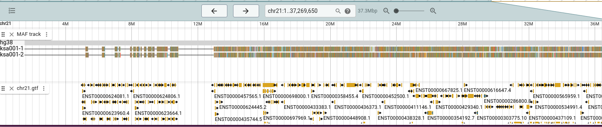
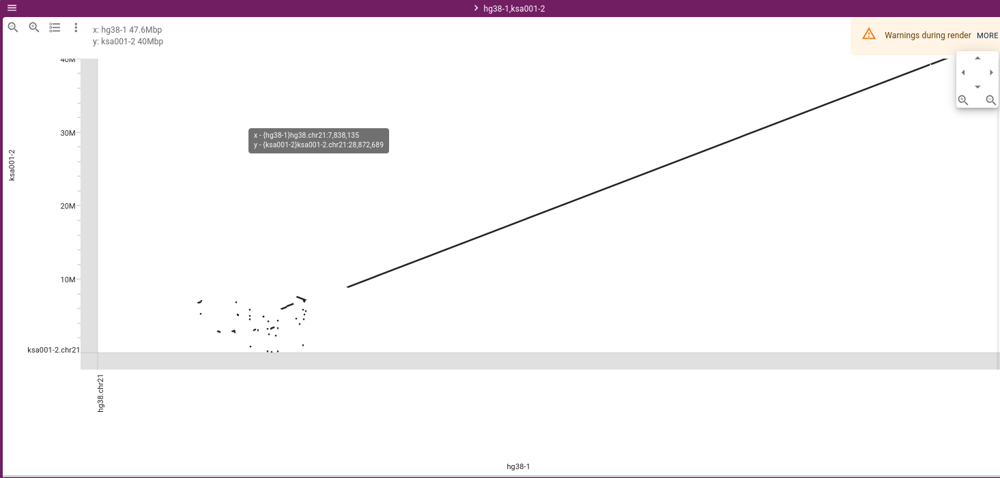
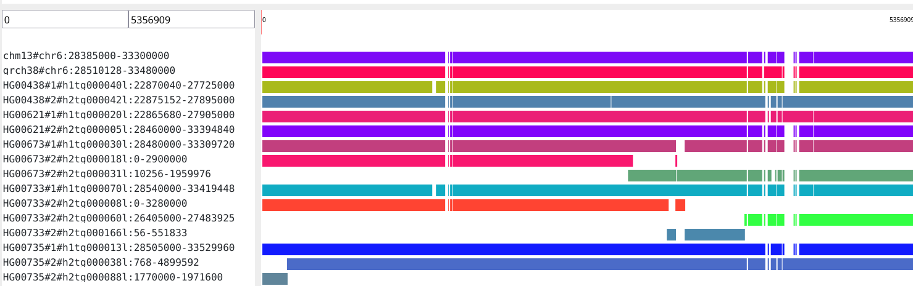

# JBrowse visualization

Workflow to visualize pggb graphs in jbrowse


* JBrowse: https://github.com/GMOD/jbrowse-components/

* JBrowse MAF plugin: https://github.com/cmdcolin/jbrowse-plugin-mafviewer

* WGA Tools: https://github.com/wjwei-handsome/wgatools

* MAFChunk: https://github.com/pangenome/mafchunk

* `cargo install maf2bed`

1. build graph with `pggb`, e.g.:
   `docker run -it -v .:/data ghcr.io/pangenome/pggb:latest pggb -i data/<SEQUENCES.fa> -M -o data/OUTPUTDIR -n 2 -t 15 -p 90 -s 5000`
   - `SEQUENCES.fa` contains the assemblies from which to build the
     graph; name them `ASSEMBLYNAME.CHROMOSOME`, e.g., `hg38.chr1`,
     `chm13.chr12`, etc.
2. `wgatools pafpseudo -f <FASTA_FILE> -g <TARGET> -o <OUTPUT.maf> <INPUT.paf>`
   - `FASTA_FILE` is the file with all the sequenced from which the
     pggb graph was built
   - `TARGET` is the name of the assembly to use as reference; can
     leave empty to create multiple .maf files as output
   - `OUTPUT.maf` is the resulting MAF file
   - `INPUT.paf` is the PAF file generated by pggb during graph
     construction
3. chunk the resulting MAF file using MAFchunk: `mafchunk <OUTPUT.maf> 100000 > <CHUNKED.maf>`
   - `100000` is a decent chunk size for interactive visualization,
     can increase to `250000` for large chromosomes
4. Create the pseudo-bed for mafviewer: `cat <CHUNKED.maf> | maf2bed <TARGET> | bgzip > out.bed.gz`
5. Index the pseudo-bed: `tabix -p bed out.bed.gz`

Next start JBrowse (desktop, but web will work too) using:
```
# starts webpack dev server
cd products/jbrowse-desktop
yarn start

# starts electron window
cd products/jbrowse-desktop
yarn electron
```

Install the MAF Plugin (Tools -> Plugin Store -> MAFViewer Plugin) if
you have not done yet.

Then, add a MAF track; provide as input `out.bed.gz` and
`out.bed.gz.tbi`, and the names of the assemblies in `FASTA_FILE`.

Now you can add other tracks for your chosen reference. 

The result should look something like this:


## Synteny view

Showing synteny is easier as JBrowse can directly visualize the .paf
file generated by `pggb`.

1. Add the assemblies from the alignment to JBrowser (File -> Open Assembly)
2. It's easiest to open a dotplot first with the 2 assemblies to
   compare; create a new synteny track for this, adding the .paf file
   generated by `pggb`. The result should look something like this:
   
   - if the dotplot is empty, it's most likely a problem with naming
     the assemblies, e.g., hg38.chr21 vs just chr21 (in the FASTA
     files providing the assemblies)
   - also, the order in which assemblies are compared seems to matter;
     use as first assembly for the dotplot view the assembly listed
     first in the .paf file
3. Once the dotplot shows, you can select a region and generate a
   linear synteny view for it. You can also add tracks to the
   assemblies that are compared. Results may look like this:
   

## Todo

There are several limitations, and tools like
[Waragraph](https://github.com/chfi/waragraph) are better suited for
interactive visualization of genome structure, but not necessarily of
function.

### Linear view

Waragraph and `odgi layout` provides 1D visualizations that look like
this:


The main issue with this visualization is that it's hard to project
functional information on functional information would relate mainly
to a single track. The MAFViewer mainly replaces this
functionality.
It would be nice to have:
- ability to add copy numbers as colors
- 
