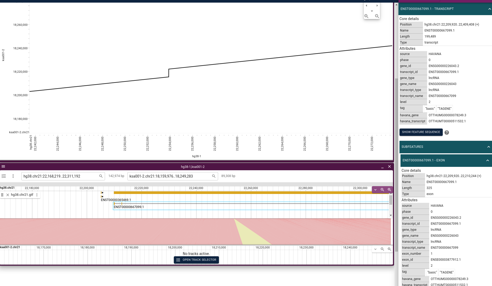

# JBrowse Pangenome Visualization Guide

This guide outlines the process for visualizing pangenome graphs using JBrowse, specifically tailored for bioinformaticians interested in genomic research. The workflow leverages several tools and plugins, facilitating an interactive exploration of pangenomes.

## Prerequisites

Ensure the following tools and resources are available:

- **JBrowse**: [JBrowse components](https://github.com/GMOD/jbrowse-components/)
- **JBrowse MAF Plugin**: [MAFViewer](https://github.com/cmdcolin/jbrowse-plugin-mafviewer)
- **WGA Tools**: [wgatools](https://github.com/wjwei-handsome/wgatools)
- **MAFChunk**: [mafchunk](https://github.com/pangenome/mafchunk)
- **maf2bed**: Install via Cargo with `cargo install maf2bed`

## Workflow

### 1. Building the Graph with `pggb`

Generate the graph using `pggb` within a Docker container:

```bash
docker run -it -v .:/data ghcr.io/pangenome/pggb:latest pggb -i data/<SEQUENCES.fa> -M -o data/OUTPUTDIR -n 2 -t 15 -p 90 -s 5000
```

- Replace `<SEQUENCES.fa>` with your assembly file names, formatted as `ASSEMBLYNAME.CHROMOSOME` (e.g., `hg38.chr1`, `chm13.chr12`).

### 2. Generating MAF Files with `wgatools`

Convert PAF files to MAF format for visualization:

```bash
wgatools pafpseudo -f <FASTA_FILE> -g <TARGET> -o <OUTPUT.maf> <INPUT.paf>
```

- `<FASTA_FILE>`: File containing sequences from the pggb graph build.
- `<TARGET>`: Reference assembly name (leave empty for multiple .maf outputs).
- `<OUTPUT.maf>`: Resulting MAF file.
- `<INPUT.paf>`: PAF file from pggb graph construction.

### 3. Chunking MAF Files

Split the MAF file into manageable chunks for visualization:

```bash
mafchunk <OUTPUT.maf> 100000 > <CHUNKED.maf>
```

- `100000` is recommended for interactive visualization, adjustable based on chromosome size.

### 4. Creating Pseudo-BED for MAFViewer

Generate a pseudo-BED file from the chunked MAF:

```bash
cat <CHUNKED.maf> | maf2bed <TARGET> | bgzip > out.bed.gz
```

### 5. Indexing the Pseudo-BED

Index the generated BED file:

```bash
tabix -p bed out.bed.gz
```

## Launching JBrowse

1. **Start JBrowse** (either desktop or web version):

   For the desktop version, initiate the webpack dev server and electron window:

   ```bash
   cd products/jbrowse-desktop
   yarn start
   yarn electron
   ```

2. **Install the MAF Plugin** from the Plugin Store within JBrowse if not already done.

3. **Add a MAF Track** using the `out.bed.gz` and `out.bed.gz.tbi` files, along with the assembly names from your `<FASTA_FILE>`.

You can now add additional tracks for your reference assembly, facilitating a comprehensive pangenome analysis.

## Result Preview

The visualization process culminates in an interactive pangenome view, akin to this example:


# Synteny View Visualization

Visualizing synteny becomes straightforward with JBrowse's capability to directly use the `.paf` files produced by `pggb`. Follow these steps for an insightful synteny analysis:

## 1. Adding Assemblies to JBrowse

Navigate to File -> Open Assembly in JBrowse and add the assemblies involved in the alignment.

## 2. Creating a Dotplot

To initiate, open a dotplot comparing two assemblies. This involves creating a new synteny track and incorporating the `.paf` file from `pggb`. The resulting dotplot provides a visual representation of synteny between the assemblies:


### Troubleshooting Dotplots

- An empty dotplot usually indicates a mismatch in assembly naming conventions (e.g., using `hg38.chr21` versus simply `chr21`). Ensure consistency in naming within the FASTA files.
- The order of assembly comparison might affect the output. For optimal results, arrange the dotplot with the assembly listed first in the `.paf` file as the primary assembly.

## 3. Generating Linear Synteny Views

Following the dotplot visualization, you can select specific regions to create linear synteny views. Additionally, you may add tracks to enhance the comparison between the assemblies. Such linear views can reveal structural variations like insertions:



This step-by-step approach simplifies the visualization of genomic synteny, enabling a deeper understanding of structural variations and alignments.


## Future Directions and Enhancements

The current workflow, while effective for visualizing pangenome graphs, has its limitations. Tools like [Waragraph](https://github.com/chfi/waragraph) excel in interactive genome structure visualization but may fall short in highlighting genomic functions. This section outlines potential enhancements and considerations for future development.

### Linear View Enhancements

While Waragraph and `odgi layout` offer compelling one-dimensional (1D) visualizations akin to:


These visualizations often struggle to incorporate functional genomic information, which is typically relevant to individual tracks. MAFViewer addresses some of these concerns but further improvements could include:

- **Color-coded Copy Numbers**: Enhancing visual differentiation through color-coding based on copy number variations.
- **Reference Switching**: Streamlining the process to switch between different reference genomes.
- **Comprehensive Feature Addition**: Facilitating the addition of genomic features across all assemblies within a pangenome, requiring a unified approach like merging GFF3 files in JBrowse.
- **PanGene Annotations**: Integrating [PanGene](https://github.com/lh3/pangene) annotations for GFA visualization could provide insightful views on gene presence and variation within the pangenome. A potential improvement could involve developing a GFA Adapter for JBrowse to allow for direct interaction with GFA or derived formats, enabling visualization of gene paths or functional features:


### Two-Dimensional (2D) Visualization

Exploring 2D genome visualizations as offered by Waragraph presents an innovative way to examine genome structures:


However, integrating these visualizations into JBrowse, while maintaining a coherent relationship with existing data and features, poses a significant challenge and an exciting area for future exploration.

